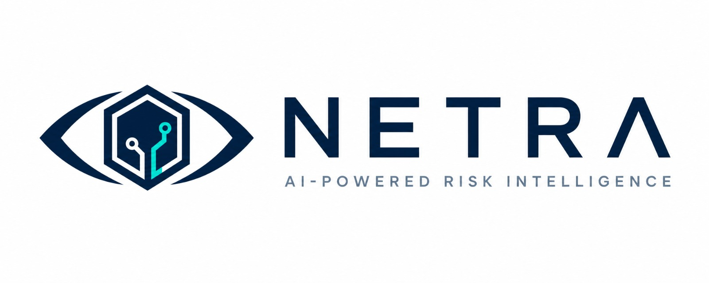

<p align="center">
  
</p>

<h1 align="center">The NETRA Platform</h1>

<p align="center">
  <strong>An Enterprise-Grade Augmented Intelligence Platform for CyberRisk Quantification & Banking Security Posture Management</strong>
</p>

---

## 1. Executive Summary

Project NETRA is not a simple vulnerability scanner; it is a fully-integrated, enterprise-grade **Augmented Intelligence Platform** for risk management in banking and cybersecurity. Its core innovation is a paradigm shift away from static, checklist-based security assessment. Instead, NETRA models the **dynamic, real-time "pulse"** of an organization's cyber-risk posture to produce risk quantifications that are **more accurate, more transparent, and fundamentally actionable.**

The platform is a complete ecosystem, comprising a demo retail-banking web application with deliberately toggle-able vulnerabilities (the "Bug Lab"), a sophisticated CyberRisk Quantifier (CRQ) engine powered by the FAIR framework and Monte Carlo simulation, a real-time WebSocket feedback loop, and an AI-powered risk assistant with RAG-enhanced contextual intelligence. It is designed from the ground up to be **auditable, explainable, and aligned with the strategic mission** of translating technical security events into the language executives understand — money.

NETRA provides security analysts and risk officers with an **AI co-pilot**, transforming them from reactive incident responders into strategic decision-makers who can quantify, prioritize, and communicate cyber risk in terms of Expected Annual Loss (EAL).

---

## 2. The Philosophical Core — From "Checklist" to "Living Risk"

The foundational problem with traditional cybersecurity risk management is its reliance on a static "checklist" — a point-in-time audit that is outdated the moment it is completed. NETRA's core philosophy is that an organization's risk posture is a **living, breathing story**, not a snapshot.

We engineered a **real-time event-driven architecture** where every security event — whether a vulnerability being toggled on in the Bug Lab, a manual finding submitted by a penetration tester, or an automated scan result ingested via API — immediately triggers a full risk recomputation. The CRQ dashboard updates **live over WebSocket**, reflecting the new posture within seconds. This transforms the risk model into a continuous "movie" of the organization's security health, allowing stakeholders to observe how risk **evolves, compounds, and recedes** in real time.

> **Key Principle:** Every number in NETRA is computed, auditable, and traceable — never hardcoded, never cached without provenance. Flip a vulnerability in the bank site → the CRQ dashboard's risk numbers move, live.

---

## 3. The Risk Engine — FAIR Framework & Monte Carlo Simulation

The heart of NETRA is its **CyberRisk Quantifier (CRQ) engine**, a FastAPI-based risk computation platform that translates security events into monetary impact using industry-standard methodologies.

The engine is built on the **FAIR (Factor Analysis of Information Risk)** framework, the only international standard (OpenFAIR) for quantitative cyber risk analysis. Rather than producing arbitrary "high/medium/low" labels, FAIR decomposes risk into its constituent factors — Threat Event Frequency, Vulnerability, Loss Magnitude — and models each probabilistically.

**Monte Carlo simulation** runs thousands of iterations across these probability distributions, producing a full loss exceedance curve with P10/P50/P90 percentiles, 95th and 99th percentile Value at Risk (VaR), and a headline Expected Annual Loss (EAL) figure denominated in ₹. This gives decision-makers not just "how much could we lose?" but "how confident are we in that estimate?"

The engine also features:
- **Idempotent event ingestion** — duplicate events are detected and rejected, ensuring clean data provenance
- **Asset-level and organization-level rollup** — risk is computed per-asset and aggregated across the portfolio
- **Threshold breach detection** — when a recomputation causes EAL to shift by more than 20%, a red "threshold breach" banner alerts stakeholders immediately
- **Event sourcing** — every computation is linked back to the source event UUID, creating a full audit trail in `crq_eal_snapshots`

---

## 4. The AI Architecture — A Multi-Tool Approach

NETRA's intelligence is not a single model but a **suite of specialized tools**, each purpose-built for a facet of the risk quantification problem.

**The Risk Quantification Engine (FAIR + Monte Carlo):** The primary computation pipeline generates Expected Annual Loss using probabilistic modelling via NumPy and SciPy. Each security event triggers a full recomputation with thousands of Monte Carlo iterations, producing statistically rigorous loss distributions.

**The Optimization Layer (PuLP + NetworkX):** For portfolio-level risk optimization and dependency analysis, NETRA leverages linear programming (PuLP) and graph-based modelling (NetworkX) to understand how risks propagate through interconnected assets and identify optimal remediation strategies.

**The AI Risk Assistant (Groq LLM + RAG):** A context-aware AI assistant powered by Groq's high-speed LLM inference, augmented with a curated RAG knowledge base (`packages/ai-knowledge/`). For every query, the assistant retrieves relevant organizational context — recent findings, current EAL, top contributors — and generates actionable, grounded recommendations. It receives system-level notifications whenever the risk posture changes, keeping its context perpetually fresh.

**The Async Task Engine (Celery + Redis):** Heavy computational workloads — Monte Carlo simulations, portfolio rollups, AI inference — are offloaded to Celery workers backed by Redis, ensuring the API remains responsive even under load.

---

## 5. The Application & Governance Ecosystem

The AI's intelligence is made accessible through a modern, **multi-tier application architecture**, supported by comprehensive observability infrastructure.

**Database (Supabase Postgres):** A single Supabase Postgres instance hosts both the bank's operational tables (`users`, `accounts`, `transactions`) and the CRQ analytical tables (`crq_ingested_events`, `crq_eal_snapshots`, `crq_vulnerabilities`). Database migrations are managed by Alembic, ensuring schema evolution is versioned and repeatable.

**Bank API (Express 5):** The bank's backend serves as the **event source** — handling authentication (with OTP via EmailJS), customer data, and the Bug Lab toggle system. Every toggle flip or manual finding dispatches a structured event to the CRQ engine via HTTP, with the `[CRQ]` log prefix providing full traceability.

**CRQ API (FastAPI):** The risk engine's high-performance Python API is the **central nervous system**, handling event ingestion, FAIR/Monte Carlo computation, WebSocket broadcasting, AI assistant orchestration, and Prometheus metrics export. It is fully containerized with Docker.

**Bank Frontend (React 19 + Vite):** The primary user interface, featuring a full retail-banking experience with an embedded CRQ Dashboard tab. The dashboard renders live risk metrics (EAL, VaR, P10/P50/P90 distributions, top risk contributors) and receives real-time updates via WebSocket — no manual refresh required.

**CRQ Analyst Console (Next.js):** An optional standalone dashboard for dedicated risk analysts, providing a deeper analytical view of the CRQ data independent of the banking interface.

**Observability Stack:** A production-grade monitoring layer comprising Prometheus (metrics), Grafana (dashboards), Loki (log aggregation), Tempo (distributed tracing via OpenTelemetry), and GlitchTip (Sentry-compatible error tracking). Pre-configured dashboards are provisioned automatically.

---

## 6. Repository Layout

```
apps/
  bank-web/        React 19 + Vite — the bank site (includes CRQ Dashboard tab)      :5173
  bank-api/        Express 5 — bank auth, data, & Bug Lab toggle endpoints            :3001
  crq-api/         FastAPI — the CRQ risk engine (FAIR, Monte Carlo, AI gateway)      :8000
  crq-web/         Next.js — standalone CRQ analyst console (optional)                :3000
db/
  bank/            Bank site SQL schema (reference)
  crq/             CRQ schema + seed SQL (applied to shared Supabase project)
infra/             Prometheus / Grafana / Loki / Tempo / Keycloak configs
packages/
  ai-knowledge/    RAG knowledge base for the CRQ AI assistant
scripts/archive/   One-off historical scripts (not needed to run)
docs/              In-depth platform guides
docker-compose.dev.yml + Makefile   → CRQ Docker stack orchestration
```

- `bank-web` + `bank-api` are **npm workspaces** (installed from the repo root).
- `crq-web` is **not** a workspace (its React 18 types clash with bank-web's React 19 when hoisted) — install it separately with `npm run install:crq-web`.
- `crq-api` is Python and runs in Docker (or natively with `uv`).

---

## 7. Technology Stack

**Frontend:** React 19, Vite 8, Next.js 14 (CRQ console)

**Backend:** Express 5 (Node.js), FastAPI (Python), Uvicorn, Celery

**AI / Risk Modelling:** FAIR Framework, Monte Carlo Simulation, NumPy, SciPy, PuLP, NetworkX, Groq LLM (RAG-enhanced AI assistant)

**Database:** Supabase (Postgres), Redis 7.4, SQLAlchemy (async), Alembic

**Observability:** Prometheus, Grafana, Loki, Tempo (OpenTelemetry), GlitchTip

**Security & Validation:** Helmet, Zod, CORS, JWT (python-jose)

**DevOps & Tooling:** Docker Compose, Makefile, Ruff, MyPy (strict), Pytest + Hypothesis, ESLint, Git, GitHub

---

## 8. Getting Started

To get a local copy up and running, follow these steps. The platform requires running multiple services — the CRQ engine (Docker), the bank API, and the bank frontend.

### Prerequisites

- **Node.js** ≥ 18 (20+ recommended)
- **Docker Desktop** (current version)
- **A Supabase project** (free tier is fine)
- **Python 3.12** + [uv](https://docs.astral.sh/uv/) *(optional — for running crq-api without Docker)*

### Installation

**1. Clone the Repository:**

```bash
git clone https://github.com/your-username/netra-platform.git
cd netra-platform
```

**2. Install JavaScript Dependencies:**

```bash
npm install                   # Installs bank-web + bank-api (npm workspaces)
npm run install:crq-web       # Only if you want the standalone CRQ analyst console
```

**3. Configure Environment Files:**

Copy each `.env.example` to `.env` and populate with your credentials:

**`apps/crq-api/.env`:**

```env
CRQ_SUPABASE_URL=postgresql+asyncpg://postgres.<ref>:<password>@aws-0-<region>.pooler.supabase.com:5432/postgres
CRQ_SUPABASE_SERVICE_KEY=<anon or service key>
CRQ_SUPABASE_JWT_SECRET=<project JWT secret>
CRQ_GROQ_API_KEY=<free key from console.groq.com>     # Powers the AI assistant
CRQ_DISABLE_AUTH=true
```

**`apps/bank-api/.env`:**

```env
SUPABASE_URL=https://<ref>.supabase.co
SUPABASE_ANON_KEY=<anon public key — Supabase → Project Settings → API>
SUPABASE_SERVICE_ROLE_KEY=<service_role key — same page>
OTP_SECRET=<any random string ≥ 16 chars>
EMAILJS_SERVICE_ID=...          # From your EmailJS account; sends the login OTP
EMAILJS_TEMPLATE_ID=...
EMAILJS_PUBLIC_KEY=...
EMAILJS_PRIVATE_KEY=...
CRQ_BASE_URL=http://localhost:8000
CRQ_ORG_ID=1
```

**`apps/bank-web/.env`** *(optional — only if CRQ isn't on localhost):*

```env
VITE_CRQ_API=http://localhost:8000/api/v1
VITE_CRQ_ORG_ID=1
```

**4. Start the CRQ Engine (Docker):**

```bash
docker compose -f docker-compose.dev.yml up -d --build    # or: npm run crq:up
```

**5. Start the Bank API:**

```bash
npm run dev:bank-api          # → http://localhost:3001
```

**6. Start the Bank Frontend:**

```bash
npm run dev:bank-web          # → http://localhost:5173
```

**7. Verify the platform is healthy:**

```bash
curl http://localhost:8000/health
# → {"healthy":true,"checks":{"postgres":{"status":"ok"},"redis":{"status":"ok"}}}
```

The application will be accessible at **http://localhost:5173**. Log in as a **Manager** (demo credentials are in `apps/bank-api/scripts/seed.js`).

---

## 9. Troubleshooting

| Symptom | Cause / Fix |
|---------|-------------|
| Dashboard: "Cannot reach the CRQ service…" | `crq-api` not running, or stale image. Run `curl http://localhost:8000/health`. |
| Form / toggle → 500 on `/events` | Stale container code — `docker compose -f docker-compose.dev.yml up -d --build crq-api crq-worker` |
| Container name conflict (`/crq-redis` in use) | `docker compose -f docker-compose.dev.yml down` then `up` again |
| bank-api won't start, `ZodError` on `SUPABASE_URL` | `apps/bank-api/.env` missing or in the wrong folder (Notepad may add `.txt`) |
| Portfolio EAL stuck at ₹4.2 Cr | Expected until the first event fires — then it switches to the live rollup |
| Toggle changes nothing in CRQ | `CRQ_BASE_URL` missing from `apps/bank-api/.env`, or crq-api is down. Check bank-api console for `[CRQ]` lines |
| "● OFFLINE" badge | WebSocket blocked — reads still work, only live auto-refresh is lost |
| `crq-web` build fails: "Shield cannot be used as a JSX component" | You added it to root `workspaces`. It must stay isolated — `npm run install:crq-web` |

**View logs:** `docker compose -f docker-compose.dev.yml logs -f crq-api` or `make logs s=crq-api`

---

## 10. Acknowledgments

This project was inspired by the critical intersection of **cybersecurity and financial risk management** — the recognition that security vulnerabilities are not merely technical issues but quantifiable financial exposures that deserve the same rigorous analysis as market or credit risk.

Special thanks to the open-source community for the powerful libraries and frameworks that made this project possible, including FastAPI, React, Express, XGBoost, the FAIR Institute for their pioneering work on risk quantification, and the many other tools referenced in this stack.

---

## 11. Contributors

**Team NETRA**

This project was developed by a team  0xAxiom.

---

